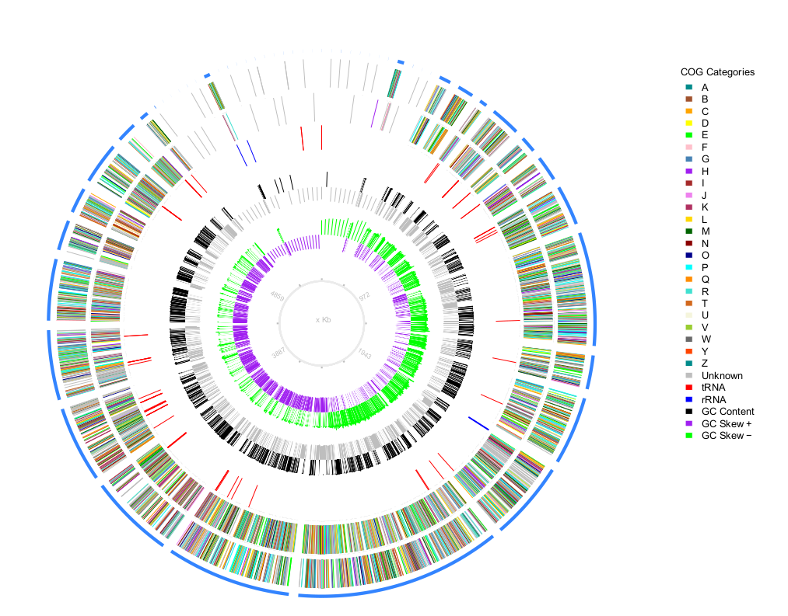

# plotMyGBK
-----------

plotMyGBK is a very simple to use pipe that use a genbank file and give you a nice circular graph (using omiccircos to make the graph)

# Output example

## Requisites

* Python 2.7 with [biopython](http://biopython.org/wiki/Download) and [pandas](https://pandas.pydata.org/getpandas.html) modules.
* R (tested in 3.2.3), and the following libraries: 
	* [Rsamtools](https://bioconductor.org/packages/release/bioc/html/Rsamtools.html) 
	* [OmicCircos](http://bioconductor.org/packages/release/bioc/html/OmicCircos.html)
	* [data.table](https://cran.r-project.org/web/packages/data.table/index.html)

## Usage

plotMyGBK have minimal use:

	python plotMyGBK.py -g mygenbank.gbk

and a complete use:
	
	python plotMyGBK.py -g mygenbank.gbk -c annotationFile.tsv -w 3000 -s 1500 -l 500

* -g is the genbank file
* -c annotation file from prokka that contain the COG annotation (or something with that format).
* -w Windows size, to computing GC content and GC skew set the windows size, default:3000
* -s Step size, size in bp to move windows (-w), default:1500
* -l Filter Contigs, show only contigs that have more than 500bp

## Output

Since your gbk, plotMyGBK will generate a folder called results\_GBKNAME.faa where GBKNAME is the genbank file, this folder contain several files like faa, fna, parsed rpsblast results, other files necessaries to plot and last the plot in pdf format.

## Notes
* When you execute plotMyGBK.py make sure data folder and plotstep.R are in that directory.
* The rpsblast in the data folder was compiled in Mac OSX, if you use other OS, you have to put the corresponding binary of rpsblast in this data folder

## References
* Ying Hu Chunhua Yan <yanch@mail.nih.gov> (2015). OmicCircos: High-quality circular visualization of omics data. R package version
  1.8.1.

## Warning
* The script will plot at least all contigs with genes, this is ideal for prokaryotes gbk where are some contigs (~100 or less), but when you plot five hundred or more contgis, maybe will not look nicely.
